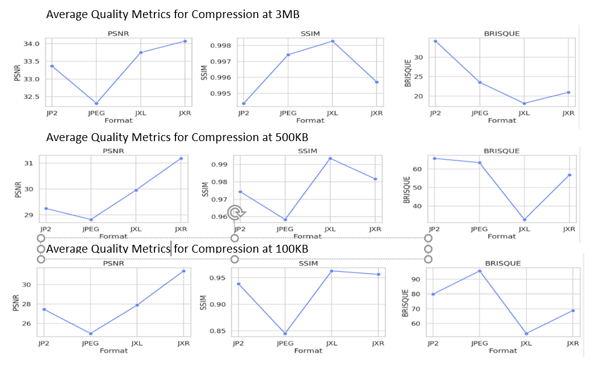

# Effect of Compression on Camera Identification via PRNU (Photo-Response Non-Uniformity)
This project investigates the application of Photo Response Non-Uniformity (PRNU) for source camera identification, with a specific focus on the challenges posed by image compression. By analyzing various compression formats and bitrates, we assess how source attribution is affected by image degradation across different denoising filters, specifically Sigma and Gaussian filters.

To begin with, PRNU patterns are defined as fixed-pattern noises introduced by a camera sensor during image acquisition. These near-invisible artifacts serve as a unique "camera fingerprint," allowing a specific image or video to be traced back to its source device. In other words, if two different cameras/sensors are used to take a picture/video of a particular scene, they both leave unique noise only attributable to the source camera.

## Motivation
So far, existing literature identifies image compression as a significant attack to the PRNU-based attribution. However, this study examines if this degradation is consistent across all extraction filters and how significant is a compression attack. We aim to determine if the loss of these "fingerprints" is a universal consequence of compression or if the residue retention is dependent on the specific compression scheme and filtering method employed to extract the scene information. With this work we hope to further highlight the ongoing relevance and reliability of PRNU-based identification methods in source camera identification, especially where appropriate removal of scene information is applied.

This becomes necessary with the growing adoption of technology. The amount of media data that is shared and transferred between people, networks and devices are rapidly increasing daily. Once an image/video is shared, or transferred, it becomes very difficult to identify their source device where they must have been captured. This is a big problem in multimedia forensics, as it is often necessary to check for data tampering and other abuses like leaks of illegal images/videos. More importantly as these data undergo various forms and levels of compression during capture, upload and/or transfer from one device/network to the other.

## Building the Camera Fingerprint or Residue

To build the camera fingerprint or residue, the PRNU patterns from images from the camera is first extracted. This is done by filtering the individual images with a chosen filter. The filtered images are then subtracted from their original selves. The underdlying assumption is that the camera sensor leaves unique uncorrelated noise patterns on the images of scenes captured. Therefore by filtering, we isolate or extract these noise patterns from the actual scene information. This is such that the weighted mean of a large number of noise patterns from images from a particular camera sensor approximates to the camera fingerprint or reference pattern unique only to that camera.

### Mathematical Formulation
The extraction of the noise residue and the generation of the camera reference pattern are defined as follows:

$$
F_i = I_i - W(I_i)
$$

$$
R = \frac{1}{n} \sum_{i=1}^{n} F_i
$$

**Where:**
* **$I_i$**: The $i$-th original image in the training set.
* **$W(\cdot)$**: The denoising operator (Sigma or Gaussian filter).
* **$F_i$**: The extracted noise residue (fingerprint) for image $i$.
* **$R$**: The computed camera reference pattern (mean PRNU).

## Choice of Filter
For this project sigma and gaussian filters were chosen. These filters are state-of-the-art examples of the two broad classification of digital filters. While sigma filter has very good edge preservation properties, the gaussian filter has a strong natural bluring capabilties for suppressing high frequencies on the other hand, making it one of the best examples of the non-edge preserving filter class.


## Data Outline
Images used for this project are the dataset from Jianfeng Lu, Caijin Li, Xiangye Huang, Chen Cui, and Mahmoud Emam for their 2024 paper:<a href="https://www.kaggle.com/datasets/mahmoudemam85/source-camera-identification-a-custom-dataset">"Source Camera Identification Algorithm Based On Multi-Scale Feature Fusion". </a>

However, in order to avoid double compression, only images of the PNG formats were considered for the JPEG, JP2, JXR and JXL compression. The sizes of these selected images were about 20MB on the average before compression. And the target sizes for compression were 3MB, 500KB, and 100KB across the various schemes to give a uniform compression ratios of 7:1, 40:1, and 200:1 respectively.

A total of 80 images were sampled from 5 different cameras, labelled thus as D36, D37, D38, D39, D40. For the training, 60 images were used for building the reference PRNU pattern. This was divided into 5 categories (12 for each camera device). The remaining 20 images were then used to perform the correlation on the referenced patterns. They were also split into 5 categories (4 for each camera device)

## Identifying Source Cameras

To identify the source camera of an image, we simply compute the correlation used to match the reference pattern of a selected camera computed as above with a PRNU pattern extracted from the image. The camera with the highest correlation value confirms the source match. But to optimise for speed in our case, we used the fast normalised correlation for matching the extracted PRNU to the computed reference patterns of selected cameras.

## Analysis and Results

### JPEG Compression Results Across the Various Compression Levels.


### Correlation Scores And Confusion Matrix For JPEG and JXL Before Compression, At 3MB and 100KB Compression Levels.
 

### Matching Accuracy ResultsThe following table compares the identification accuracy of the Sigma vs. Gaussian filters across varying compression levels.

| Compression Scheme | Before Compression | 3MB (Light) | 500KB (Mid) | 100KB (Heavy) |
| :--- | :---: | :---: | :---: | :---: |
| | **Sigma / Gaussian** | **Sigma / Gaussian** | **Sigma / Gaussian** | **Sigma / Gaussian** |
| **JPEG** | 100% / 100% | 100% / 100% | 100% / 95% | 100% / 65% |
| **JP2000 (JP2)** | 100% / 100% | 100% / 95% | 100% / 20% | 100% / 55% |
| **JXR** | 100% / 100% | 100% / 100% | 100% / 95% | 100% / 35% |
| **JXL** | 100% / 100% | 100% / 90% | 100% / 50% | 100% / 35% |

### Correlation Values of Sigma Filter Vs Gaussian Filter Across Different Standards and Compression Ratios
 

### Quality Metrics
 

### Result Analysis
Robustness of Sigma Filter:
* From the results, the matching accuracy for source identification with the sigma filter remained stable across different compression ratios and schemes. At higher compression ratios, the correlation values used for matching the right camera also increased. This is consistent with theory, as compression tends to remove scene information leaving compression artifacts as a result. So the more the scene information is progressively replaced by compression artifacts, the more these artifacts leak into the extracted PRNU pattern. These artifacts are camera independent. Thus leading to high correlation values during matching, as these artifacts are both pressent in the image and the extracted pattern.
* But to understand why the sigma filter remains robust even when contaminated with compression artifacts, it would important to look at how compression and sigma filters work in general. It is known that compression algorithms in general exploit the redundancy in data for its reduction. From the sample compressed with JPEG attached above, blocky artifacts immediately start to appear in low-frequency, uniform regions of the images as they were aggressively compressed to 100KB, while still preserving the high-frequency, edge structure.  On the other hand, the sigma filter relies on adaptive content low pass filtering to extract the PRNU pattern. This means it can still extract PRNU from regions preserved with minimal contamination by compression artifacts to sufficiently build the reference pattern of the source camera.

Limitations of Gaussian Filter:
* The gaussian filter also achieved good SCI under mild compression (3MB). But its accuracy sharply declined under stronger compression. This decline follows the reduction in the quality of the compressed images. In some cases (e.g., JP2 or JXL at 100KB), accuracy to 35%. This is even when the correlation values improved mildly with aggressive compression, suggesting that while what is left after compression is closer to the reference pattern, this does not necessarily improve the matching accuracy.

* The drop in accuracy can be attributed to the strength of smoothing from the filtering process. The filter attributes weights to pixels based on their distance from one another, and not by how different they are. So a high pixel value very close to a low pixel value is considered to be the same, and the gaussian filter assigns the similar weightings to them. Hence more scene information is captured alongside the extracted PRNU pattern close to them. And since these patterns are subtle, they are consequently drowned out by the neghbouring scene information. So even though  the now extracted PRNU is more similar like the referenced pattern, what are essentially left is the compression artifacts with most of the PRNU signal lost. 

Quality Metrics of Compressed Images:
* In addition to forensic performance, we computed different quality metrics (the  PSNR and SSIM, for reference quality metrics and then BRISQUE, for the no reference quality metrics) to better understand the relationship between visual fidelity and camera fingerprint preservation. We observed that classification accuracy reduced as images were progressively degraded for gaussian filter, while the results from sigma filter remained stable. This is even for JPEG compression, which provided the worst quality results across the three metrics and levels of compression.

### Conclusion
This study demonstrates that compression alone is not a universally effective attack against PRNU-based SCI. Instead, its impact is strongly mediated by the choice of denoising filter used during PRNU extraction. Edge-preserving filters such as the sigma filter maintain robust performance even under aggressive compression, whereas linear smoothing filters like the Gaussian filter suffer significant degradation. These findings suggest that the resilience of PRNU-based systems depends less on the compression scheme itself and more on the interaction between compression artifacts, scene suppression, and the non-linear characteristics of the extraction filter.


### How to Run
#### 1. Clone repo
git clone https://github.com/njPlanck/PRNU---Effects-of-Compression-on-Source-Camera-Identification.git

cd PRNU---Effects-of-Compression-on-Source-Camera-Identification

#### 2. Create environment
python -m venv venv
source venv/bin/activate   # or .\venv\Scripts\activate on Windows

#### 3. Install dependencies
pip install -r requirements.txt

#### 4. Run Compression script extraction
python src_code/compression.py

#### 5. Run PRNU extraction
python src_code/prnu.py --input data/train 


#### 6. Run evaluation
python src_code/analysis.py 

#### Expected Structure
```
project_root/
├── data/
│   ├── train/
│   └── test/
├── src_code/
└── README.md
```

## References
1. M. S. Behare, A. S. Bhalchandra, and R. Kumar, "Source Camera Identification using Photo Response Noise Uniformity," in Proc. 3rd Int. Conf. on Electronics Communication and Aerospace Technology (ICECA), Coimbatore, India, Jun. 2019.
2. J. Lu, C. Li, X. Huang, C. Cui, and M. Emam, "Source camera identification algorithm based on multi-scale feature fusion," Forensic Science International: Digital Investigation, published online Aug. 15, 2024.
3. I. Amerini, R. Caldelli, A. Del Mastio, A. Di Fuccia, C. Molinari, and A. P. Rizzo, "Dealing with video source identification in social networks," Signal Processing: Image Communication, vol. 56, pp. 23–31, Apr. 2017.
4. S. Chakraborty, "Effect of JPEG compression on Sensor-based Image Forensics," 2021 4th International Conference on Information and Computer Technologies (ICICT), HI, USA, 2021, pp. 104-109, doi: 10.1109/ICICT52872.2021.00025. keywords: {Location awareness;Q-factor;Image forensics;Image coding;Correlation;Digital images;Transform coding;Digital Image Forensics;Photo Response Non-Uniformity;sensor noise;camera identification;manipulation localization},


