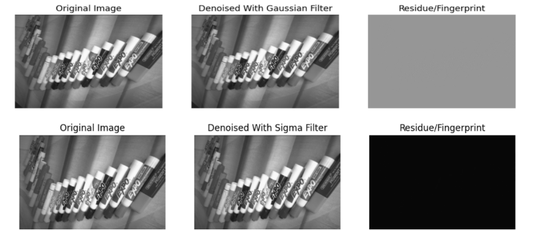
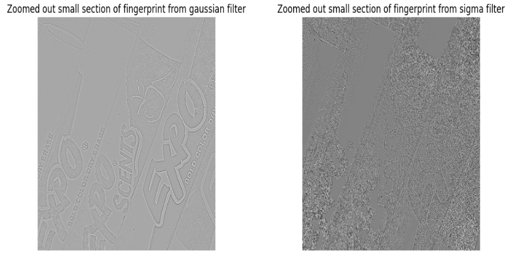
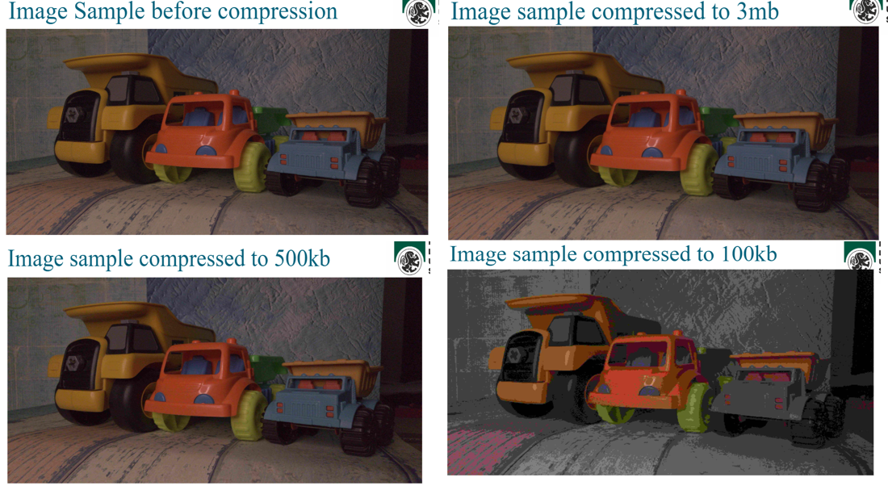
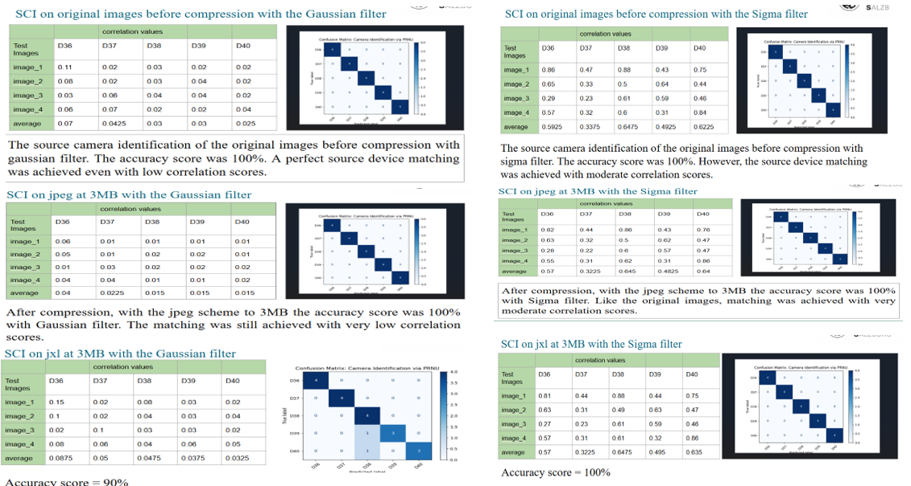
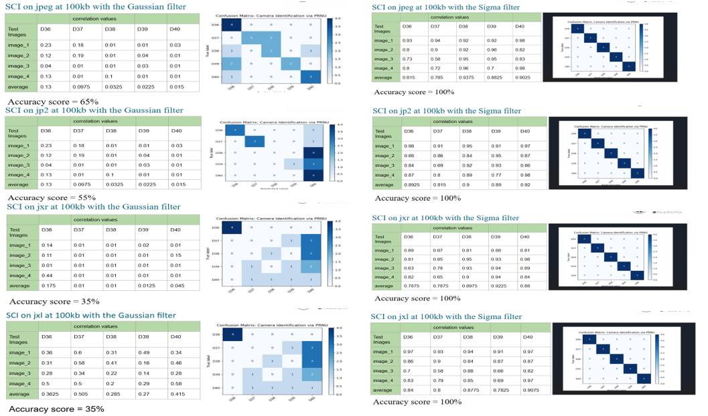
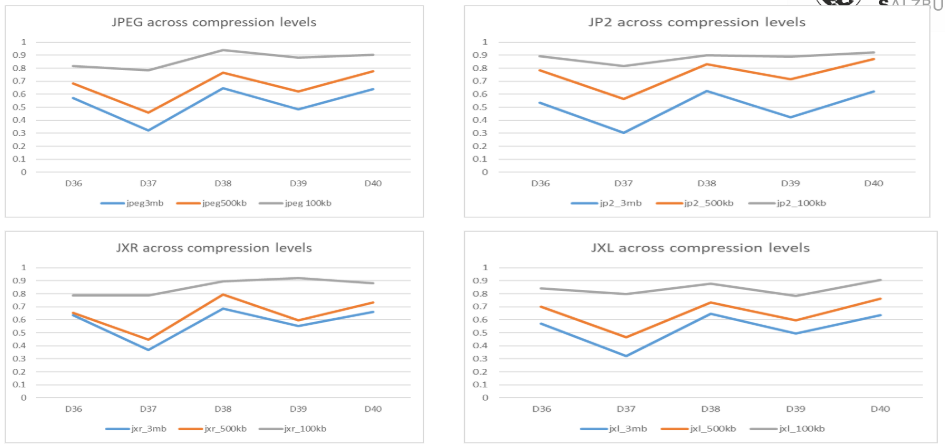
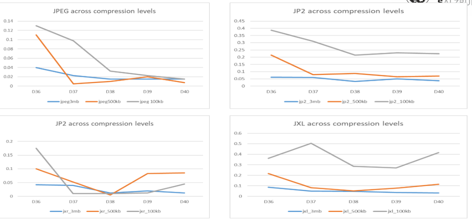

# Effect of Compression on Camera Identification via PRNU (Photo-Response Non-Uniformity)
This project investigates the application of Photo Response Non-Uniformity (PRNU) for source camera identification, with a specific focus on the challenges posed by image compression. By analyzing various compression formats and bitrates, we assess how source attribution is affected by image degradation across different denoising filters, specifically Sigma and Gaussian filters.

PRNU patterns are deterministic, fixed-pattern noises introduced by a camera sensor during image acquisition. These near-invisible artifacts serve as a unique "camera fingerprint," allowing a specific image or video to be traced back to its source device.

While existing literature identifies image compression as a significant challenge to PRNU-based attribution, this study examines whether this degradation is consistent across all extraction filters. We aim to determine if the loss of these "fingerprints" is a universal consequence of compression or if the residue retention is dependent on the specific compression scheme and filtering method employed. With this work we further highlight the ongoing relevance and reliability of PRNU-based identification methods in source camera identification, especially when appropriate removal of scene information is applied.

## Motivation
With the growing adoption of technology, the amount of media data that is shared and transferred between people, networks and devices has also notably increased. Once an image/video is shared, or transferred, it becomes very difficult to identify their source device where they must have been captured. This is a big problem in multimedia forensics, as it is often necessary to check for data tampering and other abuses like leaks of illegal images/videos. More especially as these media data usually undergo various forms and levels of compression when they are captured, uploaded and/or transferred from one device/network to the other.

## Building the Camera Fingerprint or Residue

To build the camera fingerprint or residue, the PRNU patterns from images from the camera is first extracted. This is done by filtering the individual images with a chosen filter. The filtered images are then subtracted from their original selves. The underdlying assumption is that the camera sensor leaves unique uncorrelated noise patterns on the images of scenes captured. Therefore by filtering, we isolate or extract these noise patterns from the actual scene information. And the weighted mean of these noise patterns from images of the same camera sensor approximates to the camera fingerprint or reference pattern unique only to that camera.

$D = W(I)$

$F = I - D$
    
$R = \bar{F}$

$\bar{F} = \frac{1}{n}\sum_{i=1}^n F_i$

where;

- \( I \): Original image  
- \( W \): Chosen filter or denoising Function 
- \( D \): Denoised image   
- \( F \): Extracted fingerprint  
- \( R \): Reference pattern computed from fingerprints Fi_s

## Choice of Filter
For this project sigma and gaussian filters were chosen. These filters are state-of-the-art examples of the two broad classification of digital filters. While sigma filter has very good edge preservation properties, the gaussian filter has a strong natural bluring capabilties for suppressing high frequencies on the other hand, making it one of the best examples of the non-edge preserving filter class.

## Data Outline
Images used in this project were from the dataset used by Jianfeng Lu, Caijin Li, Xiangye Huang, Chen Cui, and Mahmoud Emam for their 2024 <a href="https://www.kaggle.com/datasets/mahmoudemam85/source-camera-identification-a-custom-dataset"> paper: "Source Camera Identification Algorithm Based On Multi-Scale Feature Fusion". </a>

However, in order to avoid double compression, only images of the PNG formats were considered for the JPEG, JP2, JXR and JXL compression. And sizes of these selected images were about 20MB on the average before compression. While the target sizes for compression were 3MB, 500KB, and 100KB across the various schemes to give a uniform compression ratios of 7:1, 40:1, and 200:1 respectively.

A total of 80 images were sampled from 5 different cameras, labelled thus as D36, D37, D38, D39, D40. For the training, 60 images were used for building the reference PRNU pattern. This was divided into 5 categories (12 for each camera device). On the other hand, 20 images were used to perform the correlation on the referenced patterns. They were also split into 5 categories (4 for each camera device)

## Identifying Source Cameras

To identify a source camera of an image, we simply compute the correlation used to match reference pattern noise from selected camera. The camera with the highest correlation value confirms the source match. to optimise for speed, the fast normalised correlation was used for matching the images to their computed reference patterns.

## Analysis and Results

### JPEG Compression Results Across the Various Compression Levels.

### Correlation Scores And Confusion Matrix For JPEG and JXL SCI.
 

### Correlation values of sigma filter across different standards and compression ratios

### Correlation values of guassian filter across different standards and compression ratios

In addition to forensic performance, we computed different quality metrics (the  PSNR and SSIM, for reference quality metrics and then BRISQUE, for the no reference quality metrics) to better understand the relationship between visual fidelity and camera fingerprint preservation. We observed that classification accuracy reduced as images were progressively degraded for gaussian filter, while the results from sigma filter remained stable and even showed that as more scene information was removed due to compression, the correlation of the pattern noise to the reference pattern for each device improved across all standards.

## Result Analysis
Robustness of Sigma Filter:
* The Sigma filter consistently yielded high correlation values and 100% SCI accuracy across all tested compression formats and target sizes- even at extreme compression levels (e.g., 100KB). This demonstrates the Sigma filter strength in preserving fine sensor noise patterns critical for reliable fingerprint extraction.

Limitations of Gaussian Filter:
* While the Gaussian filter achieved perfect identification under mild compression (3MB), its accuracy sharply declined under stronger compression. This was consistent with reduction in quality of the compressed images. In some cases (e.g., JP2 or JXL at 100KB), accuracy dropped below 50%, and correlation scores were notably low. This emphasizes its reduced effectiveness in challenging conditions, due to uniform smoothing which may suppress PRNU traces.

Compression Standard Comparison:
* JPEG and JXR showed better performance under the Gaussian filter with mild compression (unlike JP2 and JXL), but failed as compression progressed.
* All standards showed robustness under Sigma filter filtering, both in accuracy and high correlation values.

Correlation Trends:
* Under mild or no compression at all, PRNU results from gaussian filter maintained low correlation values yet accurate predictions, highlighting that correlation magnitude alone is not always a reliable indicator unless the pattern noise of the source camera is well-preserved.
* In contrast, Sigma filtering maintained both high correlation and stable classification, making it more dependable even for very poor quality images.

## How It Works
Training Phase:
* Extracts PRNU noise from each image.
* Computes an average noise fingerprint for each camera.
  
Testing Phase:
* Extracts noise from a test image.
* Compares it against each camera fingerprint using normalized cross-correlation.
* Selects the camera with the highest similarity score.

## References
1. M. S. Behare, A. S. Bhalchandra, and R. Kumar, "Source Camera Identification using Photo Response Noise Uniformity," in Proc. 3rd Int. Conf. on Electronics Communication and Aerospace Technology (ICECA), Coimbatore, India, Jun. 2019.
2. J. Lu, C. Li, X. Huang, C. Cui, and M. Emam, "Source camera identification algorithm based on multi-scale feature fusion," Forensic Science International: Digital Investigation, published online Aug. 15, 2024.
3. I. Amerini, R. Caldelli, A. Del Mastio, A. Di Fuccia, C. Molinari, and A. P. Rizzo, "Dealing with video source identification in social networks," Signal Processing: Image Communication, vol. 56, pp. 23–31, Apr. 2017.
4. S. Chakraborty, "Effect of JPEG compression on Sensor-based Image Forensics," 2021 4th International Conference on Information and Computer Technologies (ICICT), HI, USA, 2021, pp. 104-109, doi: 10.1109/ICICT52872.2021.00025. keywords: {Location awareness;Q-factor;Image forensics;Image coding;Correlation;Digital images;Transform coding;Digital Image Forensics;Photo Response Non-Uniformity;sensor noise;camera identification;manipulation localization},

