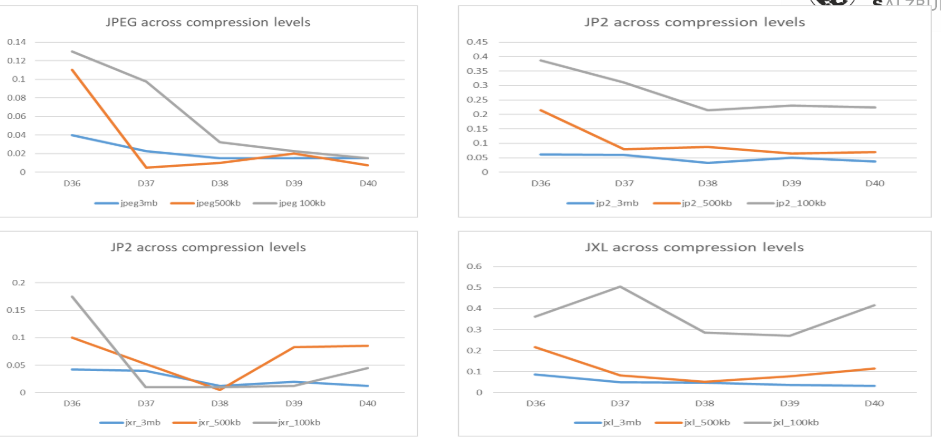

# Effect of Compression on Camera Identification via PRNU (Photo-Response Non-Uniformity)
This project demonstrates the application of Photo Response Non-Uniformity (PRNU) for source camera identification, emphasizing the challenges posed by image compression. By analyzing multiple compression formats and levels using classical filtering techniques, we were able to assess how PRNU patterns behave under varying degrees of image degradation.

In addition to forensic performance, we computed different quality metrics (the  PSNR and SSIM, for reference quality metrics and then BRISQUE, for the no reference quality metrics) to better understand the relationship between visual fidelity and camera fingerprint preservation. We observed that classification accuracy reduced as images were progressively degraded for gaussian filter, while the results from sigma filter remained stable and even showed that as more scene information was removed due to compression, the correlation of the pattern noise to the reference pattern for each device improved across all standards.

Overall, our work highlights the ongoing relevance and reliability of PRNU-based identification methods, especially when appropriate removal of scene information is applied. This result supports the use of filters like sigma filter ahead of gaussian filter in digital forensics because of their robustness in the presence of significant compression.

## Overview
The Photo Response Non-Uniformity (PRNU) is a fixed pattern noise introduced by a camera device during the manufacturing of the device. Patterns like these are near invisible artifacts which make the device different from others. This is such that when an image/video is acquired by a camera, it is possible to trace their source device. For instance, images of the same scene captured with different camera have different pattern noise unique to each camera. These noise are also be referred to as camera fingerprints/residue.

## Motivation
With the growing adoption of technology, we have also seen the rapid growth of the amount of media data that is shared and transferred between people, networks and devices. Once an image/video is shared, or transferred, it becomes very difficult to identify their source device where they must have been captured. This is a big problem in multimedia forensics, as it is often necessary to check for data tampering and other abuses like leaks of illegal images/videos.
More especially as these media data usually undergo various forms and levels of compression when they are captured, uploaded and/or transferred from one device/network to the other

## Features
* PRNU noise extraction with gaussian and sigma filter denoising.
* Fingerprint averaging from multiple images per camera.
* Fast and robust camera matching using FFT-based normalized cross-correlation.
* Supports JPEG, PNG, JPEG2000 (.jp2), and JPEG XL (.jxl) image formats.
* Automatic validation and evaluation using a confusion matrix.

## Output
* Computes correlation values used to match patten noise of compressed images with.
* Displays a confusion matrix comparing predicted vs. actual camera sources.
### Correlation values of sigma filter across different standards and compression ratios

### Correlation values of guassian filter across different standards and compression ratios

## Result Analysis
Robustness of Sigma Filter:
* The Sigma filter consistently yielded high correlation values and 100% SCI accuracy across all tested compression formats and target sizes- even at extreme compression levels (e.g., 100KB). This demonstrates the Sigma filter strength in preserving fine sensor noise patterns critical for reliable fingerprint extraction.

Limitations of Gaussian Filter:
* While the Gaussian filter achieved perfect identification under mild compression (3MB), its accuracy sharply declined under stronger compression. This was consistent with reduction in quality of the compressed images. In some cases (e.g., JP2 or JXL at 100KB), accuracy dropped below 50%, and correlation scores were notably low. This emphasizes its reduced effectiveness in challenging conditions, due to uniform smoothing which may suppress PRNU traces.

Compression Standard Comparison:
* JPEG and JXR showed better performance under the Gaussian filter with mild compression (unlike JP2 and JXL), but failed as compression progressed.
* All standards showed robustness under Sigma filter filtering, both in accuracy and high correlation values.

Correlation Trends:
* Under mild or no compression at all, PRNU results from gaussian filter maintained low correlation values yet accurate predictions, highlighting that correlation magnitude alone is not always a reliable indicator unless the pattern noise of the source camera is well-preserved.
* In contrast, Sigma filtering maintained both high correlation and stable classification, making it more dependable even for very poor quality images.

## How It Works
Training Phase:
* Extracts PRNU noise from each image.
* Computes an average noise fingerprint for each camera.
  
Testing Phase:
* Extracts noise from a test image.
* Compares it against each camera fingerprint using normalized cross-correlation.
* Selects the camera with the highest similarity score.

## References
1. M. S. Behare, A. S. Bhalchandra, and R. Kumar, "Source Camera Identification using Photo Response Noise Uniformity," in Proc. 3rd Int. Conf. on Electronics Communication and Aerospace Technology (ICECA), Coimbatore, India, Jun. 2019.
2. J. Lu, C. Li, X. Huang, C. Cui, and M. Emam, "Source camera identification algorithm based on multi-scale feature fusion," Forensic Science International: Digital Investigation, published online Aug. 15, 2024.
3. I. Amerini, R. Caldelli, A. Del Mastio, A. Di Fuccia, C. Molinari, and A. P. Rizzo, "Dealing with video source identification in social networks," Signal Processing: Image Communication, vol. 56, pp. 23–31, Apr. 2017.
4. For AI- Compression we used Hannah Neumann's pretrained model from : https://github.com/Hannah-Neumann/ai-image-compression/tree/main

